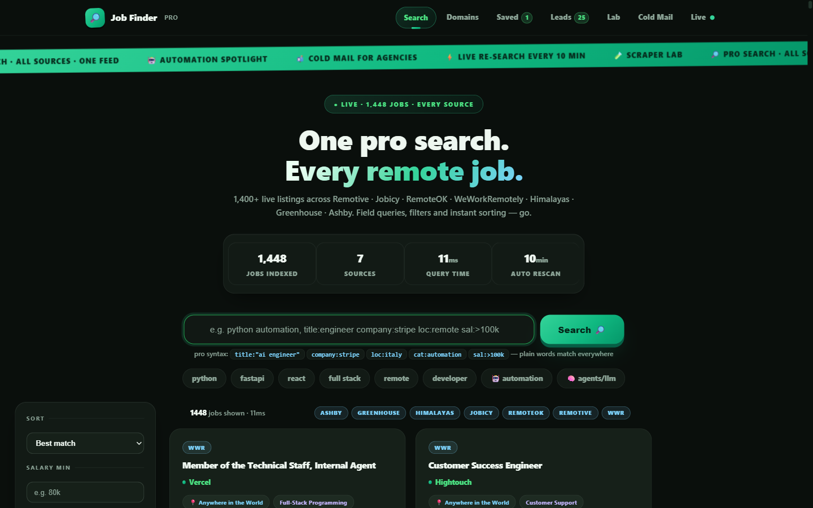
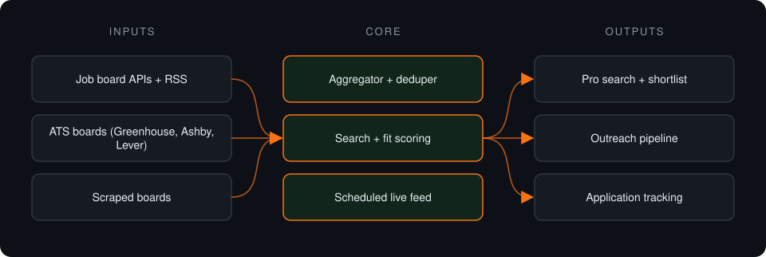
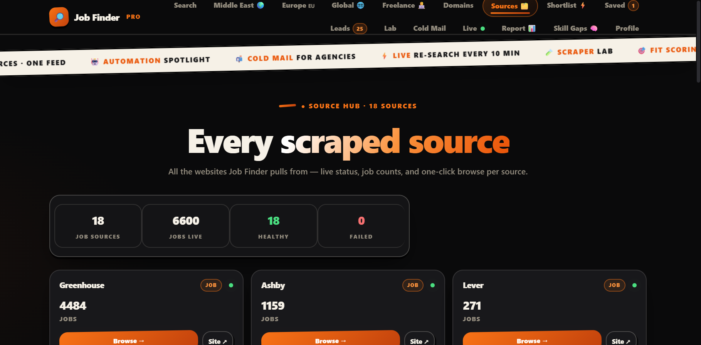
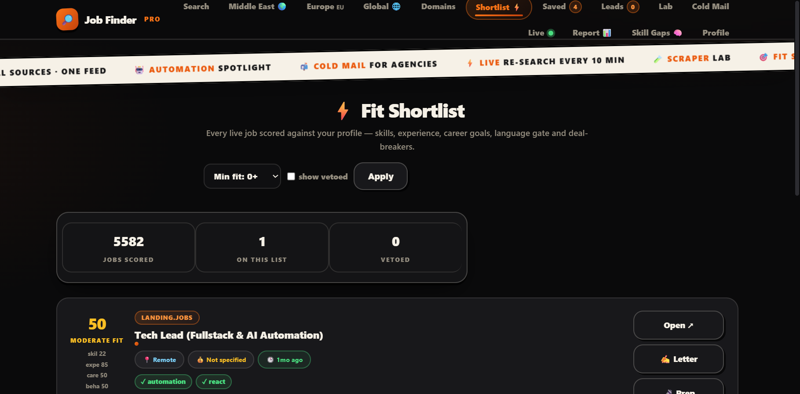
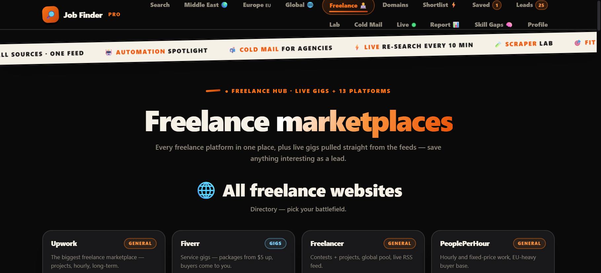

# Job Finder

**Self-hosted job aggregator: one search across 16+ remote-job sources, plus fit scoring, a shortlist, outreach tools and a live feed.**

> **This is a proprietary project. Source code is private. This page showcases the system's architecture and results.**

**Case study page:** [https://jryahia.github.io/showcase-job-finder/](https://jryahia.github.io/showcase-job-finder/)

## Problem it solves

Remote job listings are scattered across boards, RSS feeds and company ATS pages. This local-first tool aggregates them into one searchable feed and adds tools to shortlist, track and act on the right ones.

## Architecture

1. Sources are fetched through APIs, RSS, ATS endpoints and scrapers.
2. Listings are normalized into one local SQLite store.
3. Search, filters and fit scoring rank the results.
4. Shortlisted roles move into outreach and application tracking.

## Key features

- 16+ sources in one feed
- Salary, level, recency and type filters
- Fit scoring and ranked shortlist
- Scraper lab for new sources
- Local-first: data stays on the machine

## Tech stack

    

## What it does in practice

- Replaces checking a dozen boards with one local search.

## Screenshots

> Screenshots show the app running on seeded demo data, not client data.

**One search across every source**

**Source overview**

**Fit-scored shortlist**

**Freelance marketplaces hub**

---

Built by [Yahya Jarray](https://github.com/jryahia). Interested in a similar system? [Get in touch](mailto:yahiajarray43@gmail.com).

This repository contains no source code. It is a case study for a proprietary project. © Yahya Jarray.
